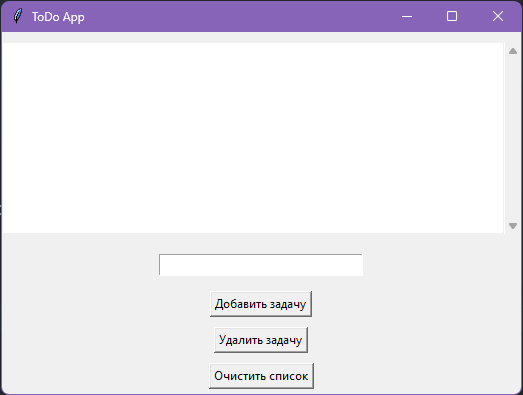
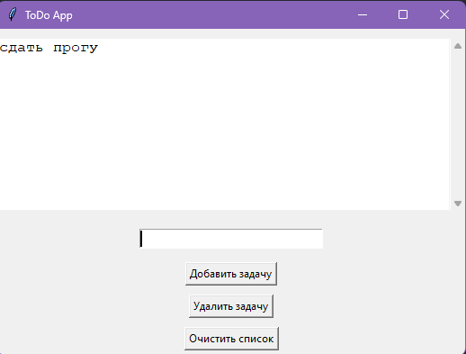
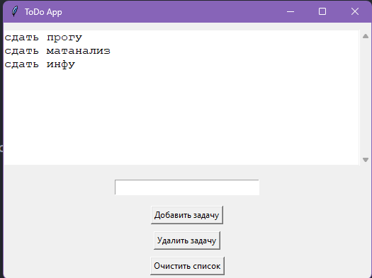
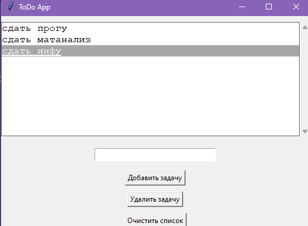
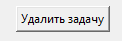
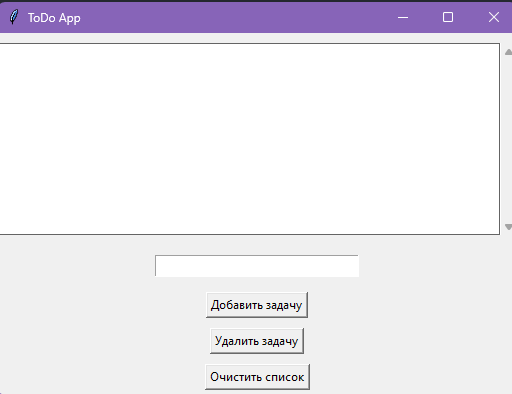
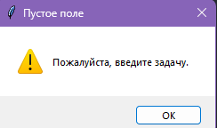
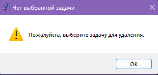

### Прог. Лабораторная работа №11
### Итоговый проект
Задания для самостоятельного выполнения
Сложность:
Rare
Реализуйте приложение с GUI (приложения-игры допускается делать с использованием TUI-пакетов) по своему варианту. Можно изменить задание на собственную тему, согласовав с преподавателем. Список GUI фреймворков:

appJar
Tkinter
Flet
wxPython
PySimpleGUI
Pyforms
Toga
PyGObject
guizero
guietta
PySide6
Dear PyGui
PyGame
Оформите README.md. Он должен содержать:

Название вашего приложения
Описание
Инструкции по запуску
Краткую справку
## вариант 1 Система учета задач (ToDo).

### Праграмное решение 
```pyton
import tkinter as tk
from tkinter import messagebox

def add_task():
    task = entry.get()
    if task:
        listbox.insert(tk.END, task)
        entry.delete(0, tk.END)
    else:
        messagebox.showwarning("Пустое поле", "Пожалуйста, введите задачу.")

def delete_task():
    try:
        index = listbox.curselection()[0]
        listbox.delete(index)
    except IndexError:
        messagebox.showwarning("Нет выбранной задачи", "Пожалуйста, выберите задачу для удаления.")

def clear_tasks():
    listbox.delete(0, tk.END)

root = tk.Tk()
root.title("ToDo App")

frame = tk.Frame(root)
frame.pack(pady=10)

listbox = tk.Listbox(
    frame,
    width=50,
    height=10,
    font=("Courier New", 12),
    bd=0,
    selectbackground="#a6a6a6"
)
listbox.pack(side=tk.LEFT, fill=tk.BOTH)

scrollbar = tk.Scrollbar(frame)
scrollbar.pack(side=tk.RIGHT, fill=tk.BOTH)

listbox.config(yscrollcommand=scrollbar.set)
scrollbar.config(command=listbox.yview)

entry = tk.Entry(
    root,
    font=("Courier New", 12)
)
entry.pack(pady=10)

add_button = tk.Button(
    root,
    text="Добавить задачу",
    command=add_task
)
add_button.pack(pady=5)

delete_button = tk.Button(
    root,
    text="Удалить задачу",
    command=delete_task
)
delete_button.pack(pady=5)

clear_button = tk.Button(
    root,
    text="Очистить список",
    command=clear_tasks
)
clear_button.pack(pady=5)

root.mainloop()

```
### Описание приложения - Система учета задач (ToDo)
Удобное приложение для эффективного учета и организации задач. Никогда не забудьте важные дела и всегда будьте на шаг впереди с системой учета задач (ToDo).
#### Инструкции по запуску
1.Запустите код в любом приложении с  Python

перед вами приложение Система учета задач (ToDo)

2.Добавьте свою первую  задачу впишите в полее для ввода свою задачу

затем нажмите Добавить задачу

после чего вы увидите вашу добавленую задачу

3.Добавьте ещё задач которые вам предстоит решить 

4.После решения одной из ваших задач - кликните лкм и ваша задача выделиться

после выделения задачи нажмите Удалить задачу

5.Когда вы решите все свои задачи нажмите на - Очистить список

после удаления списка вы увидите пустое пространство 

6.Поздравляю!!! все ваши задачи выполнены и моё приложение - Система учета задач (ToDo) ждёт ваших новых задач

### Краткая справка
1.Если не вписать в поле задачу то приложение выведет на экран ошибку

2.Если не выбрать какую задачу удалять то приложение выведет на экран ошибку



### Список использованных источников
1.https://www.youtube.com/watch?v=mLySBcS-6p0
2.https://skillbox.ru/media/code/pishem-desktopprilozhenie-na-python-s-pomoshchyu-tkinter/
3.https://habr.com/ru/articles/757112/
4.https://dzen.ru/list/gadgets/sozdanie-prilozhenii-na-python-tkinter